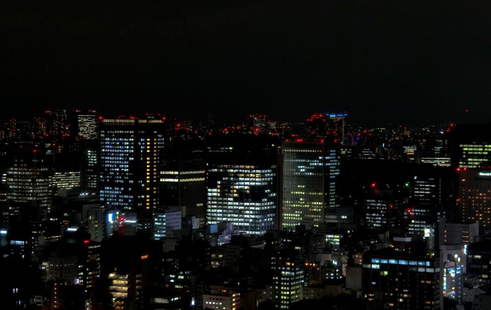
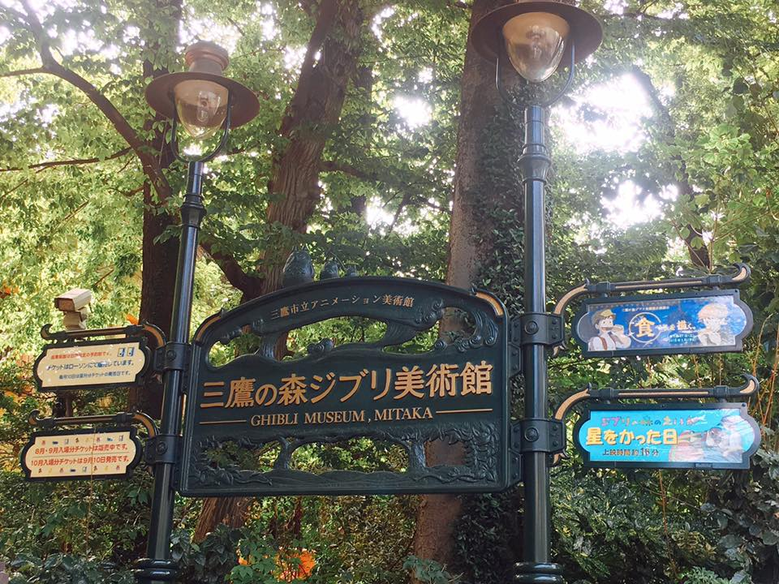

# My-TRAVEL/* ### 版面設計 ###*/

body{
	margin: 30px 10px;
	font-family: Arial,'標楷體' ,sans-serif;
}

/* L-size bigger than 980px; M-size 640~979px; S-size smaller than 639px */

#container-fluid{
	width: 960px;
	margin: auto;
}

header{
	margin-bottom: 10px;
	overflow: hidden;
}

/* overflow:hidden 將多的區塊隱藏，版面比較好看 */

#topnew{
	margin-bottom: 30px;
    overflow: hidden;
}

#content {
    margin-bottom: 30px;
    overflow: hidden;
}

footer {
    margin-bottom: 30px;
}

/* ### 細節設計 ###*/

/* HEADER LOGO */

#banner {
    float: left;
}

#banner h1 {
    margin: 0;
}

/* vertical-align: bottom 對齊底部，比較好看 */

/* container設960，三分法原則，site img 設300-360都蠻好看的 */

#banner img {
    vertical-align: bottom;
   width: 332px;
}

.jumbotron{
    
    background-color:#FFFFFF;
    }

/* HEADER NAV */

/* 可用google font 尋找喜歡的瀏覽器字體 https://fonts.google.com/ */

/* padding和margin差異可看講義*/

nav {
    float: right;
    font-size: 15px;
    font-family: 'Anton', sans-serif;
    padding-top:30px;
}

nav ul {
    margin: 0;
    padding: 0;
}

/* list-style-type: none 可把原本有序列表的點點取消*/

nav li {
    list-style-type: none;
    float: left;
}

/* 用CSS做選單!!!這邊先暫且依樣畫葫蘆，之後會教大家Bootstrap，就不用用CSS刻很久了*/

/*  display: block 每個連結字體以區塊顯示*/

/*  float: left margin-top 連結字體靠左向上對齊*/

/*  text-decoration: none 取消底線*/

/*  border-bottom: solid 3px transparent 製作一個透明的下底線*/

/*  color請參考CSS色碼對照表 https://www.toodoo.com/db/color.html */

 nav li a {
     display: block;
    float: left;
    margin-left: 20px;
    margin-top: 20px;
    text-decoration: none;
    border-bottom: solid 3px transparent;
    color: #000000;
}

h2 { 
	color: #CC0000;

}

 /*  nav li a:hover 當滑鼠在連結文字上徘徊的時候 */

 nav li a:hover {
    border-bottom-color: #ff1e97;
}

/*  HEADERPOST 圖片*/

/* vertical-align: bottom 對齊底部，比較好看 */

/* container設960，三分法原則，headerpost設620-660都蠻好看的 */

#topnew img {
    float: left;
    vertical-align: bottom;
    width: 650px;
}

 /* HEADERPOST LEAD*/

#topnew #lead {
    float: left;
    width: 300px;
    color: #ffffff;
    margin-left: 25px;
}

#topnew h2 {
    margin: 20px 0;
}

#topnew .more {
    font-size: 18px;
    font-family: 'Maven Pro', Helvetica, Arial, sans-serif;
    text-align: right;
}

/* 用CSS寫按鈕!!!這邊先暫且依樣畫葫蘆，之後會教大家Bootstrap，就不用用CSS刻很久了*/

#topnew .more a {
    color: #ffffff;
    background-image: url(img/more.png);
    background-size: 28px;
    background-repeat: no-repeat;
    background-position: right center;
    display: block;
    padding: 10px 40px 10px 0;
    text-decoration: none;
}

/* 用CSS做漸層!!!這邊先暫且依樣畫葫蘆，之後會教大家Bootstrap，就不用用CSS刻很久了*/

#topnew {
    background-color: #333333;
    background: -webkit-gradient(linear, left top, left bottom, from(#000000), to(#888888));
    background: -webkit-linear-gradient(#000000 0%, #888888 100%);
    background: -moz-linear-gradient(#000000 0%, #888888 100%);
    background: -o-linear-gradient(#000000 0%, #888888 100%);
    background: -ms-linear-gradient(#000000 0%, #888888 100%);
    background: linear-gradient(#000000 0%, #888888 100%);
    overflow: hidden;
}

/* POST 圖文 */

/* container設960，216x4+32x3=960 */

.post {
    float: left;
    width: 216px;
    margin-right: 32px;
    margin-bottom: 25px;
}
/* .post:last-child 以後新增的post，只要是最後一個，右邊界皆為0 */
.post:last-child {
    margin-right: 0;
}

/* 每四個為一組的post，右邊界皆為0 */
.post+.post+.post+.post {
    margin-right: 0;
}

   
/* ### POST 圖文 ###*/
/* container設960，216x4+32x3=960 */

.post img {
    width: 216px;
    height: auto;
    vertical-align: bottom;
    border: none;
}

.post h2 {
    font-size: 16px;
    margin: 5px 0 0;
}

.post p {
    font-size: 12px;
    margin: 10px 0;
}

.post .data {
    float: left;
    margin: 0;
}

.post .more_s {
    float: right;
    color: #FFFF00;
    font-size: 14px;
    font-family: 'Maven Pro', Helvetica, Arial, sans-serif;
    background-color: #666666;
    background-image: url(img/more.png);
    background-size: 16px;
    background-repeat: no-repeat;
    background-position: 94% 50%;
    padding: 3px 25px 3px 5px;
    margin: 0;
}

.post a {
    color: #000000;
    text-decoration: none;
    display: block;
    overflow: hidden;
}

.post a:hover {
    background-color: #FF7744
}

/* ### FOOTER ###*/

footer {
    background-color: #DDDDDD;
    padding: 5px;
}

footer p {
    float: left;
    margin-top: 10px;
    color: #ffffff
}

#iconmenu {
    float: right;
}

#iconmenu ul {
    margin: 0;
    padding: 3px 0 0;
}

#iconmenu li {
    display: inline;
    list-style-type: none;
}

#iconmenu img {
    border: none;
    width: 28px;
}

#submenu {
    clear: both;
    font-family: 'Maven Pro', Helvetica, Arial, san-serif;
    font-size: 12px;
    overflow: hidden;
}

#submenu ul {
    margin: 3px;
    padding: 0;
}

#submenu li {
    list-style-type: none;
    float: left;
}

#submenu li a {
    display: block;
    width: auto;
    border-right: solid 1px #ffffff;
    text-align: center;
    text-decoration: none;
    color: #ff1e97;
    font-weight: bold;
    padding-right: 6px;
    margin-right: 3px;
}

#submenu li:last-child a {
    border: none;
}

#submenu li+li+li a {
    border: none;
}

small {
    font-size: 12px;
    font-weight: bold;
    display: block;
    color: #ffffff;
    margin-top: 10px;
}

<!DOCTYPE html>
<html lang="en">
<head>
	<meta charset="utf-8">
	<meta http-equiv="X-UA-Compatible" content="IE=edge">
	<meta name="viewport" content="wiath=device-wiath,initial-scale=1">

	<title>shen</title>
	<link href="css/bootstrap.css" rel="stylesheet">

	<link rel="stylesheet" type="text/css" href="css.css">
	<link rel="stylesheet" href="style-l.css">
    <link rel="stylesheet" href="style-m.css" media="only screen and (min-width:600px) and (max-width:979px)">
    <link rel="stylesheet" href="style-s.css" media="only screen and (max-width:639px)">
    <link href='http://fonts.googleleapis.com/css?family=Maven+Pro:900,400' rel='stylesheet' type='text/css'>
    <link href="https://fonts.googleapis.com/css?family=Anton" rel="stylesheet">
	
</head>

<body>
    

        

            <header class="col-md-12">

	    
       
		<h1>
		
		</h1>
        

    <nav class="navbar navbar-expand-lg navbar-light bg-light">
  <a class="navbar-brand" href="#">shen</a>
  <button class="navbar-toggler" type="button" data-toggle="collapse" data-target="#navbarNav" aria-controls="navbarNav" aria-expanded="false" aria-label="Toggle navigation">
    
  </button>
  

    <ul class="navbar-nav">
      <li class="nav-item active">
        <a class="nav-link" href="#">RELATED ME(current)</a>
      </li>
      <li class="nav-item">
        <a class="nav-link" href="#">JAPON</a>
      </li>
      <li class="nav-item">
        <a class="nav-link" href="#">TRAVEL</a>
      </li>
      <li class="nav-item">
        <a class="nav-link disabled" href="#">PHOTO</a>
      </li>
    </ul>
  

</nav>

        

	

            </header>
     <main class="col-md-12">
        

     	
     	

        <h2>東京是個美麗的都市</h2>
        
這是我第一次出國的國家，不管是哪都很好玩！

        
2017/8/31

        
<a href="#">MORE</a>
	
        

    

    

        

        <a href="#">
        
        <h2>東京的夜晚</h2>
        
美麗的都市，大樓的燈光閃爍，靜謐的夜晚多了熱鬧的燈光。

        
2017/8/31

        
MORE

        </a>
        
	

        

        <a href="#">
        
        <h2>進入宮崎駿</h2>
        
只能在電視電影才能看到的人物故事，展現在眼前，覺得又實現了夢想之一。

        
2017/8/31

        
MORE

        </a>	
        

        

        <a href="#">
        
        <h2>陽光 沙灘 比基尼</h2>
        
溫暖的陽光灑落在沙灘上，寒冷的天氣中多了些許溫暖，遠眺海港的美景，台場的彩虹大橋、東京鐵塔與海鷗號，緩慢地度過一整天。

        
2017/9/1

        
MORE
	
        </a>
        

        

        <a href="#">
        
        <h2>東京市中的莊嚴</h2>
        
繁華的都市中，一座莊嚴又古典的城堡佇立著。天皇就住在那，與人民用一座高牆分隔著。

        
2017/9/2

        
MORE

     	

        </a>
        

    

        

	</main>	
	<footer class="col-md-12">
		
Shen stream

		

			<ul>
				<li></li>
				<li></li>
				<li></li>
				<li></li>
			</ul>
		

        
		

			<ul>
                <li><a href="...">Privacy Policy</a></li>
                <li><a href="...">Terms of Use</a></li>
                <li><a href="...">Contact</a></li>
            </ul>
        

        <small>Copyright &copy; Shen steam, all rights reserved.</small>
	</footer>
        

    

    
	
	
    
</body>

</html>
